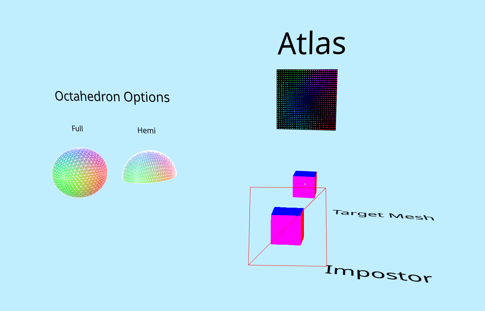
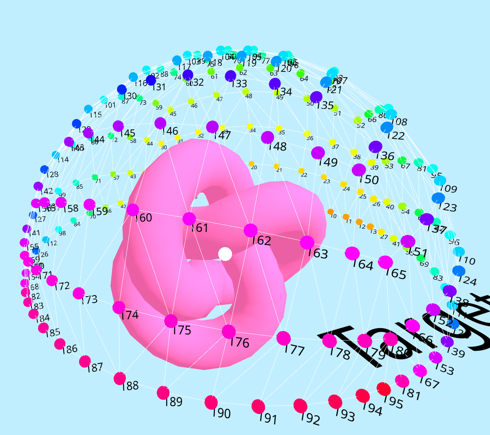
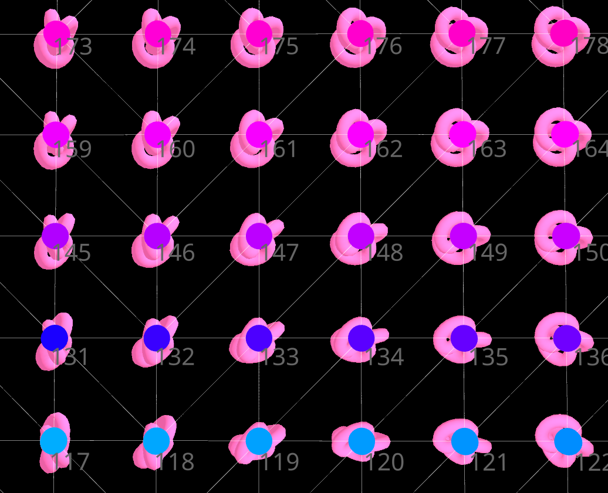

# Three Octahedral Impostor

Wip implementation of octahedral impostors in three.js, following [this](https://shaderbits.com/blog/octahedral-impostors)
great blog post on octahedral impostors in Fortnite/Unreal Engine by Ryan Brucks and the octahedron unwrapping demo by 
[Sketchpunk Labs](https://github.com/sketchpunklabs).   

This repo mostly contributes the atlas generation and showcases a **very hacky** way to render the impostor at runtime, 
by just raycasting the original mesh to find the three nearest sprites from the triangle intersection 
(each vertex represents/encodes the sprite captured from that direction) and weighting them by the barycentric coordinates. 
The result is not pretty, but it gives an idea of what's possible!

If anyone is interested in contributing, pushing this further along, the proper runtime is what's missing. 
Skipping raycasts and decode the octahedron in the shader based on view direction (at least I think that's what should be happening)
and improving the blending based on depth. The sprite is also not quite rotated correctly (this gets explained in the blog post)
which becomes especially noticeable if you look from below or above.

## Recourses
There are multiple open source implementations out there, i.e. for 
- [Godot](https://github.com/wojtekpil/Godot-Octahedral-Impostors)
- [Unity](https://github.com/MaxRoetzler/IMP)
- [Blending Billboards based on Depth](https://community.khronos.org/t/minimizing-blended-billboard-popping/41471/7)

--------------------

## Screenshots
> Scene Overview

> Raycasting the original mesh to find the three closest atlas images (here 161, 162, 176):  

> Finding the sprites on the atlas

